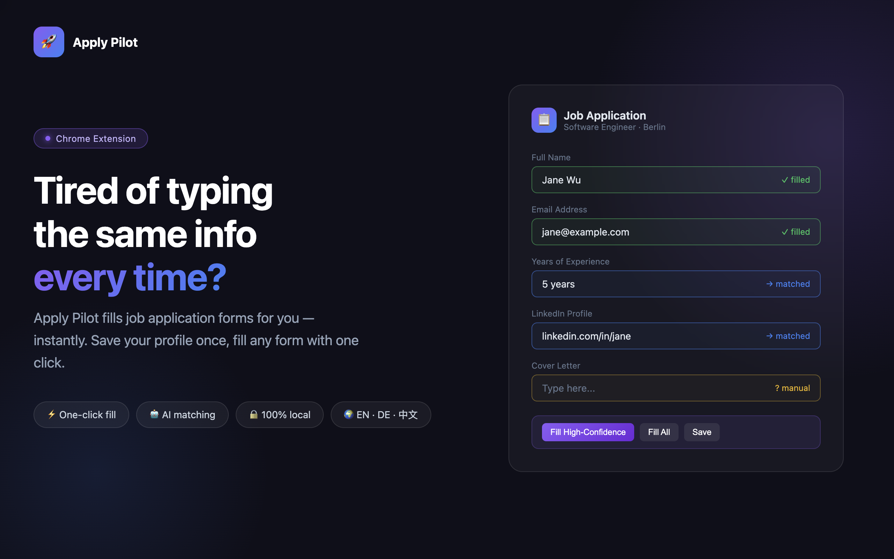
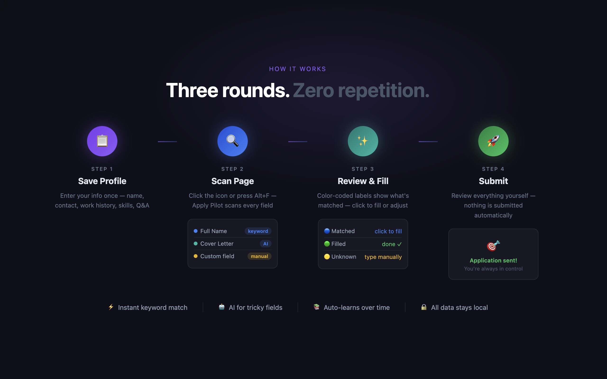
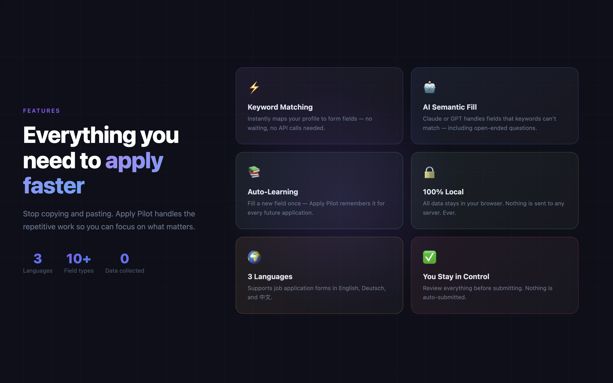

# Apply Pilot

[](LICENSE)
[](src/manifest.json)
[](https://developer.chrome.com/docs/extensions/)

**智能求职表单自动填充助手** — [English](README.md)



每次求职都要重复填写一样的信息？Apply Pilot 帮你填——一键搞定。

只需保存一份个人档案——姓名、联系方式、工作经历、教育背景、常见问答——之后打开任何求职申请页面，一键或按 `Alt+F`（Mac 上为 `Option+F`）即可自动扫描填充。

- ⚡ **关键词匹配**：即时将档案映射到表单字段
- 🔄 **历史答案复用**：自动调用你之前保存的回答
- 🤖 **AI 语义匹配**（可选）：连接 Claude 或 GPT，处理关键词无法识别的字段
- 🟡 **颜色标签**：蓝色 = 已匹配 · 绿色 = 已填写 · 黄色 = 未匹配，需手动填写
- 📚 **自动学习**：手动填写一次黄色字段，下次自动记住
- 🔒 **隐私优先**：所有数据存储在本地 Chrome Storage，不上传任何服务器
- ✅ **你来掌控**：没有任何内容会自动提交

支持英语、德语、中文表单。适用于大多数求职网站。无需注册，不收集任何数据。



## 安装步骤

1. 打开 Chrome，访问 `chrome://extensions/`
2. 打开右上角 **开发者模式**
3. 点击 **加载已解压的扩展程序**
4. 选择项目中的 `src/` 文件夹
5. 扩展安装后会自动打开设置页面

## 首次使用

### 1. 填写个人档案
安装后会自动打开设置页面，依次填写：
- **个人档案**：姓名、邮箱、电话等基本信息
- **在线资料**：LinkedIn、GitHub 链接
- **工作信息**：当前职位、工作年限、期望薪资等
- **常见问答**：预设常见面试问题的回答模板

### 2. 配置 AI（可选但推荐）
进入 **AI 设置** 标签页：
- 选择 Anthropic (Claude) 或 OpenAI (GPT)
- 输入对应的 API Key
- 点击 **测试连接** 确认可用
- 勾选 **启用 AI 语义匹配**

### 3. 开始使用
打开任意求职申请页面，两种方式触发：
- 点击浏览器工具栏的 🚀 图标 → 点击 **扫描并匹配表单**
- 使用快捷键 **Alt+F**（Mac 上为 **Option+F**）

## 工作流程

```
打开申请页面
    ↓
点击扫描（或 Alt+F / Mac 上为 Option+F）
    ↓
第一轮：关键词匹配（即时完成）
    ↓
第二轮：按历史学习的线索复用「常见问答」中的答案（精确匹配）
    ↓
第三轮：AI 语义匹配（如果启用，1-3 秒）
    ↓
页面上显示匹配结果标签：
  🔵 蓝色 = 已匹配，点击可填充
  🟢 绿色 = 已填充
  🟡 黄色 = 未匹配，需手动
    ↓
底部操作栏：
  [填充高置信度] [填充全部匹配] [存入预设回答] [关闭]
  （关闭时若未匹配栏位已有内容，可确认是否一并保存到预设回答）
    ↓
你检查并修改 → 手动点提交
```

### 底部操作栏三个按钮说明

扫描完成后，页面底部会出现操作栏。前三个主按钮含义如下：

| 按钮 | 作用 |
|------|------|
| **填充高置信度** | 只对 **置信度为「高」** 的已匹配栏位自动填入档案里的值。通常来自：关键词规则命中的字段、或 **与历史「自动学习」线索完全一致** 的字段。不会填充仅靠 AI 语义推断（中等置信度）的栏位，降低误填风险。 |
| **填充全部匹配** | 对所有 **已经匹配到档案** 的栏位（高或中等置信度）逐一填入，包括关键词匹配、历史学习复用、以及启用 AI 后的语义匹配结果。黄色「未匹配」栏位不会动。 |
| **存入预设回答** | 针对仍为 **未匹配**（黄色 `?`）的栏位：读取你在页面上 **已经填好的内容**（空白、纯空格、下拉未选真实选项的不会保存），连同该栏的线索一起写入设置里的 **常见问答**，供下次扫描时按线索自动高置信度匹配。不关闭操作栏；保存后会刷新标签状态。 |

**关闭** 会收起标签与操作栏。若此时未匹配栏位里已有有效填写，会询问是否一并写入预设回答（与「存入预设回答」同类逻辑）。

## 支持的字段类型

| 类别 | 字段 |
|------|------|
| 基本信息 | 姓名、邮箱、电话、性别、出生日期、国籍 |
| 地址 | 街道、城市、州/省、邮编、国家 |
| 在线链接 | LinkedIn、GitHub、Portfolio、个人网站 |
| 工作 | 职位、公司、工作年限、通知期、薪资、入职日期、签证 |
| 教育 | 学历、学校、专业、毕业年份 |
| 技能 | 语言能力、技术技能、证书 |

## 支持的语言

关键词匹配支持三种语言的表单：
- 🇬🇧 English
- 🇩🇪 Deutsch
- 🇨🇳 中文



## 数据安全

- 所有数据存储在本地 Chrome Storage 中，**不会上传到任何服务器**
- API Key 仅在你启用 AI 功能时用于调用 API
- 导出档案时 **不包含 API Key**
- 你可以随时在数据管理中导出备份或重置所有数据
- 也可单独 **导出 / 导入常见问答** JSON
- 可参考 [`example/`](example/) 目录中的示例文件了解导出数据的格式

## 快捷键

| 快捷键 | 功能 |
|--------|------|
| `Alt+F`（Mac：`Option+F`）| 扫描并匹配当前页面表单 |

## 填进去了但提交仍提示「缺少内容」？

部分网站可能无法立即识别自动填入的内容。遇到这种情况，**用 Tab 键逐个遍历一下表单字段**，通常就能解决。

## 已知限制

- 文件上传（简历）无法自动完成，会标记提醒你手动上传
- 某些使用 Shadow DOM 的网站（如 Workday）可能需要额外适配
- 极度动态加载的表单可能需要等页面完全加载后再扫描

## 后续改进方向

- [ ] 针对主流 ATS 平台（Greenhouse、Lever、Workday）的专门适配
- [ ] 简历文件自动上传
- [ ] 多份档案切换（不同语言/不同职位方向）
- [ ] 填充历史记录

## 参与贡献

欢迎提交 Issue 和 Pull Request！

- 本地开发与项目结构：请看 [DEVELOPMENT.zh.md](DEVELOPMENT.zh.md)
- 贡献流程与规范：请看 [CONTRIBUTING.zh.md](CONTRIBUTING.zh.md)

## 许可证

[MIT License](LICENSE)
